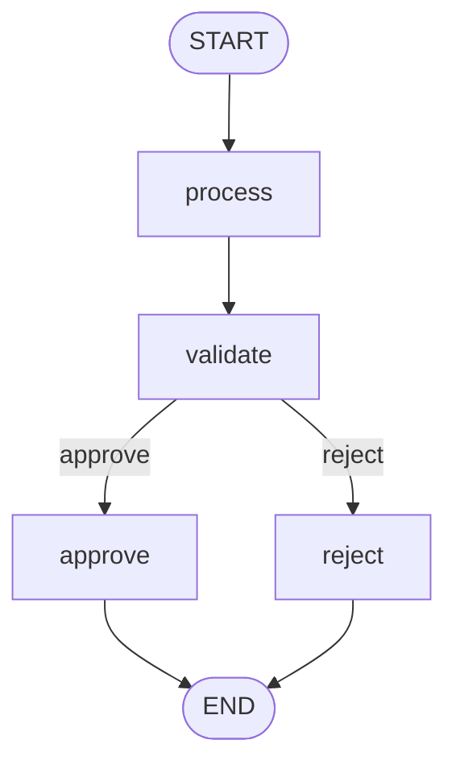
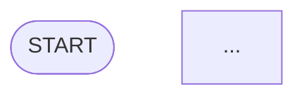

# 图可视化

本指南展示如何从 StateGraph 生成 Mermaid 流程图。

## 生成 Mermaid 图

```python
from zerograph import StateGraph, START, END

graph = StateGraph(dict)
graph.add_node("process", lambda s: {"x": 1})
graph.add_node("validate", lambda s: {"valid": True})
graph.add_node("approve", lambda s: {"approved": True})
graph.add_node("reject", lambda s: {"approved": False})
graph.add_edge(START, "process")
graph.add_edge("process", "validate")
graph.add_conditional_edges(
    "validate",
    lambda s: "approve" if s.get("valid") else "reject",
    {"approve": "approve", "reject": "reject"}
)
graph.add_edge("approve", END)
graph.add_edge("reject", END)

# 生成 Mermaid 代码
print(graph.get_graph())
```

输出：



## 条件边的显示

条件边会在箭头上标注条件值：

```mermaid
validate -->|"approve"| approve
validate -->|"reject"| reject
```

## 等待边（Fan-in）

等待边会显示多条入边汇聚到一个节点：

```python
graph.add_edge(["a", "b"], "merge")
```

```mermaid
a --> merge
b --> merge
```

## 在 Markdown 中使用

将生成的 Mermaid 代码直接嵌入 Markdown 文件：

````

````

GitHub、GitLab、Notion 等平台原生支持 Mermaid 渲染。

## 编译后的图

`CompiledStateGraph` 也有 `get_graph()` 方法（返回构建器信息）：

```python
app = graph.compile()
# 获取构建器信息
builder = app.get_graph()
```

## 参考文档

- [API: StateGraph.get_graph()](../api/graph.md)
